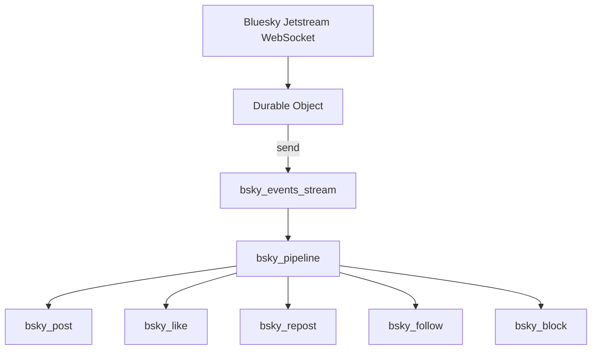

import {
	PackageManagers,
	Render,
	TypeScriptExample,
	WranglerConfig,
} from "~/components";

In this example, you will consume the public [Bluesky Jetstream](https://github.com/bluesky-social/jetstream) firehose, a live WebSocket stream of every post, like, repost, follow, and block on the network, and land it in [R2 Data Catalog](/r2/data-catalog/) as queryable Apache Iceberg tables.

You will learn a core Pipelines pattern: send every event to one stream, then use a single pipeline with multiple SQL statements to route ("fan out") that stream into several destination tables, one per event type, without running a separate pipeline for each.



## Prerequisites

<Render file="prereqs" product="workers" />

You will also need an [R2 API token](/r2/api/tokens/) with **Admin Read & Write** permissions, which includes R2 Data Catalog and R2 SQL access. You will pass this token to each sink. No Bluesky account or API key is required, as Jetstream is public and unauthenticated.

## 1. Create a new Worker project

Create a new Worker project by running the following command:

<PackageManagers
	type="create"
	pkg="cloudflare@latest"
	args={"bluesky-pipeline"}
/>

<Render
	file="c3-post-run-steps"
	product="workers"
	params={{
		category: "hello-world",
		type: "Worker only",
		lang: "TypeScript",
	}}
/>

Change into your new project directory:

```sh
cd bluesky-pipeline
```

The `pipelines` commands used later require Wrangler v4 or later. If your project was scaffolded with an older version, update it now:

<PackageManagers type="add" pkg="wrangler@latest" dev />

## 2. Define the stream schema

A stream has a single schema. Because every event type flows through the same stream, the schema is the union of the fields you want across all types. Each routing statement later selects only the columns relevant to its destination.

Create a `schema.json` file in the root of your project:

```json
{
	"fields": [
		{ "name": "event_id", "type": "string", "required": true },
		{ "name": "event_type", "type": "string", "required": true },
		{ "name": "did", "type": "string", "required": false },
		{ "name": "operation", "type": "string", "required": false },
		{ "name": "event_time", "type": "timestamp", "required": false },
		{ "name": "created_at", "type": "string", "required": false },
		{ "name": "text", "type": "string", "required": false },
		{ "name": "langs", "type": "string", "required": false },
		{ "name": "subject_uri", "type": "string", "required": false },
		{ "name": "subject_did", "type": "string", "required": false }
	]
}
```

## 3. Create an R2 bucket and enable R2 Data Catalog

Your sinks write to Iceberg tables in [R2 Data Catalog](/r2/data-catalog/), so you need a bucket with the catalog enabled.

Create an R2 bucket named `bluesky-pipeline`:

<PackageManagers
	type="exec"
	pkg="wrangler"
	args="r2 bucket create bluesky-pipeline"
/>

Enable R2 Data Catalog on the bucket:

<PackageManagers
	type="exec"
	pkg="wrangler"
	args="r2 bucket catalog enable bluesky-pipeline"
/>

When you run this command, note the **Warehouse name**. You will need it to query your data with R2 SQL.

## 4. Create the stream, sinks, and pipeline

First, create the stream from your schema file:

<PackageManagers
	type="exec"
	pkg="wrangler"
	args="pipelines streams create bsky_events_stream --schema-file schema.json"
/>

Note the **stream ID** in the output. You will use it to configure the Worker binding in the next step.

Next, create one [sink](/pipelines/sinks/) per destination table. Each sink writes to its own Iceberg table in R2 Data Catalog. Replace `YOUR_CATALOG_TOKEN` with your R2 API token.

```sh
for t in post like repost follow block; do
  npx wrangler pipelines sinks create bsky_${t}_sink \
    --type r2-data-catalog \
    --bucket bluesky-pipeline \
    --namespace bluesky \
    --table bsky_${t} \
    --catalog-token YOUR_CATALOG_TOKEN \
    --roll-interval 60
done
```

Now create one pipeline whose SQL contains multiple `INSERT` statements, one per route. Each statement filters the stream by `event_type` and projects only the columns that matter for its table.

Create a `fanout.sql` file:

```sql
INSERT INTO bsky_post_sink
  SELECT event_id, did, operation, event_time, created_at, text, langs
  FROM bsky_events_stream WHERE event_type = 'post';

INSERT INTO bsky_like_sink
  SELECT event_id, did, operation, event_time, created_at, subject_uri
  FROM bsky_events_stream WHERE event_type = 'like';

INSERT INTO bsky_repost_sink
  SELECT event_id, did, operation, event_time, created_at, subject_uri
  FROM bsky_events_stream WHERE event_type = 'repost';

INSERT INTO bsky_follow_sink
  SELECT event_id, did, operation, event_time, created_at, subject_did
  FROM bsky_events_stream WHERE event_type = 'follow';

INSERT INTO bsky_block_sink
  SELECT event_id, did, operation, event_time, created_at, subject_did
  FROM bsky_events_stream WHERE event_type = 'block';
```

Create the pipeline from the file:

<PackageManagers
	type="exec"
	pkg="wrangler"
	args="pipelines create bsky_pipeline --sql-file fanout.sql"
/>

One pipeline writes to five tables. To add a new event type later, add one sink and one `INSERT` statement. Pipeline SQL cannot be modified after creation, so you delete and recreate the pipeline to change it. To learn more, refer to [Route one stream to multiple tables](/pipelines/pipelines/manage-pipelines/#route-one-stream-to-multiple-tables).

## 5. Bind the stream to your Worker

Add the stream binding, a Durable Object to hold the WebSocket connection, and a [cron trigger](/workers/configuration/cron-triggers/) to keep the consumer alive. Replace `<STREAM_ID>` with the stream ID from step 4.

<WranglerConfig>
```toml
name = "bluesky-pipeline"
main = "src/index.ts"
compatibility_date = "$today"

[[pipelines]]
binding = "BSKY_STREAM"
stream = "<STREAM_ID>"

[[durable_objects.bindings]]
name = "JETSTREAM"
class_name = "JetstreamConsumer"

[[migrations]]
tag = "v1"
new_sqlite_classes = ["JetstreamConsumer"]

[triggers]
crons = ["*/2 * * * *"]
```
</WranglerConfig>

## 6. Consume the firehose in a Durable Object

A [Durable Object](/durable-objects/) is the right home for a long-lived WebSocket. It stays resident while the socket is open, and an [alarm](/durable-objects/api/alarms/) reconnects it if the connection drops. Buffer incoming events and `send()` them to the stream in batches to stay under the 5 MB per request limit. Persist the Jetstream `time_us` cursor so a reconnect resumes without gaps.

Replace the contents of `src/index.ts` with the following:

<TypeScriptExample filename="src/index.ts">
```typescript
import { DurableObject } from "cloudflare:workers";
import type { Pipeline } from "cloudflare:pipelines";

interface Env {
	BSKY_STREAM: Pipeline;
	JETSTREAM: DurableObjectNamespace<JetstreamConsumer>;
}

// Jetstream collection -> our short event_type. Only these are kept.
const COLLECTION_TO_TYPE: Record<string, string> = {
	"app.bsky.feed.post": "post",
	"app.bsky.feed.like": "like",
	"app.bsky.feed.repost": "repost",
	"app.bsky.graph.follow": "follow",
	"app.bsky.graph.block": "block",
};
const WANTED = Object.keys(COLLECTION_TO_TYPE);
const JETSTREAM_URL = "https://jetstream2.us-east.bsky.network/subscribe";
const FLUSH_MAX = 500; // rows per send()
const FLUSH_MS = 1000; // flush at least once per second
const RECONNECT_MS = 15000;

// Flatten one Jetstream message into a unified stream row, or null to skip.
function toRow(ev: any) {
	if (ev?.kind !== "commit" || !ev.commit) return null;
	const c = ev.commit;
	const event_type = COLLECTION_TO_TYPE[c.collection];
	if (!event_type) return null;
	const r = c.record ?? {};
	const subject = r.subject;
	return {
		event_id: `${ev.did}/${c.collection}/${c.rkey}`,
		event_type,
		did: ev.did ?? null,
		operation: c.operation ?? null,
		event_time:
			typeof ev.time_us === "number"
				? new Date(ev.time_us / 1000).toISOString()
				: null,
		created_at: typeof r.createdAt === "string" ? r.createdAt : null,
		text: event_type === "post" && typeof r.text === "string" ? r.text : null,
		langs:
			event_type === "post" && Array.isArray(r.langs)
				? r.langs.join(",")
				: null,
		subject_uri: typeof subject === "object" ? (subject?.uri ?? null) : null,
		subject_did: typeof subject === "string" ? subject : null,
	};
}

export class JetstreamConsumer extends DurableObject<Env> {
	private ws: WebSocket | null = null;
	private buf: Record<string, unknown>[] = [];
	private lastFlush = 0;
	private cursor: number | null = null;
	private flushing = false;

	// Arm the reconnect watchdog first, then connect (idempotent).
	async start() {
		await this.ctx.storage.setAlarm(Date.now() + RECONNECT_MS);
		await this.ensureConnected();
		return { connected: this.ws !== null };
	}

	private async ensureConnected() {
		if (this.ws) return;
		this.cursor ??= (await this.ctx.storage.get<number>("cursor")) ?? null;

		const params = new URLSearchParams();
		for (const c of WANTED) params.append("wantedCollections", c);
		if (this.cursor) params.set("cursor", String(this.cursor));

		const resp = await fetch(`${JETSTREAM_URL}?${params}`, {
			headers: { Upgrade: "websocket" },
		});
		const ws = resp.webSocket;
		if (!ws) throw new Error(`Jetstream handshake failed: ${resp.status}`);
		ws.accept();
		this.ws = ws;

		ws.addEventListener("message", (e) => this.onMessage(e));
		ws.addEventListener("close", () => (this.ws = null));
		ws.addEventListener("error", () => (this.ws = null));
	}

	private onMessage(e: MessageEvent) {
		let ev: any;
		try {
			ev = JSON.parse(e.data as string);
		} catch {
			return;
		}
		if (typeof ev.time_us === "number") this.cursor = ev.time_us;
		const row = toRow(ev);
		if (row) this.buf.push(row);
		if (
			this.buf.length >= FLUSH_MAX ||
			Date.now() - this.lastFlush >= FLUSH_MS
		) {
			void this.flush();
		}
	}

	// Serialize sends: flush one batch at a time, advancing the cursor on success.
	private async flush() {
		if (this.flushing) return;
		this.flushing = true;
		try {
			while (this.buf.length > 0) {
				this.lastFlush = Date.now();
				const batch = this.buf.splice(0, this.buf.length);
				const batchCursor = this.cursor;
				try {
					await this.env.BSKY_STREAM.send(batch);
					await this.ctx.storage.put("cursor", batchCursor);
				} catch (err) {
					this.buf.unshift(...batch);
					console.error("send failed, will retry", err);
					return;
				}
			}
		} finally {
			this.flushing = false;
		}
	}

	// Watchdog: reconnect if dropped, flush stragglers, always reschedule.
	async alarm() {
		try {
			await this.ensureConnected();
			await this.flush();
		} catch (err) {
			console.error("alarm error", err);
		} finally {
			await this.ctx.storage.setAlarm(Date.now() + RECONNECT_MS);
		}
	}
}

export default {
	async fetch(_req, env): Promise<Response> {
		const stub = env.JETSTREAM.get(env.JETSTREAM.idFromName("singleton"));
		return Response.json(await stub.start());
	},
	async scheduled(_event, env): Promise<void> {
		const stub = env.JETSTREAM.get(env.JETSTREAM.idFromName("singleton"));
		await stub.start();
	},
} satisfies ExportedHandler<Env>;
```
</TypeScriptExample>

Generate types for your bindings:

<PackageManagers type="exec" pkg="wrangler" args="types" />

## 7. Deploy and start the consumer

Deploy the Worker:

<PackageManagers type="exec" pkg="wrangler" args="deploy" />

Open the Worker URL once to start the firehose. The cron trigger keeps it running:

```sh
curl https://bluesky-pipeline.YOUR_SUBDOMAIN.workers.dev
```

The command returns:

```txt
{ "connected": true }
```

Tail the logs to watch it work:

<PackageManagers type="exec" pkg="wrangler" args="tail" />

## 8. Query the tables with R2 SQL

The first data lands a few minutes after the first events arrive, while the pipeline warms up.

Set your R2 SQL token, then query each table. Replace `YOUR_WAREHOUSE_NAME` with the warehouse name you noted in step 3.

```sh
export WRANGLER_R2_SQL_AUTH_TOKEN=YOUR_CATALOG_TOKEN

npx wrangler r2 sql query "YOUR_WAREHOUSE_NAME" \
  "SELECT COUNT(*) FROM bluesky.bsky_like"

npx wrangler r2 sql query "YOUR_WAREHOUSE_NAME" \
  "SELECT text, langs FROM bluesky.bsky_post WHERE langs LIKE '%en%' LIMIT 10"
```

Each table contains only its event type, projected to the relevant columns. The single pipeline did all the routing.

## Conclusion

You consumed a high-velocity public WebSocket firehose with a Durable Object, ingested it into one Pipelines stream, and used a single pipeline with multiple SQL statements to fan the stream out into five Iceberg tables by event type.

This one-stream-to-many-tables pattern generalizes to any tagged event source: clickstreams (by `event_type`), logs (by `service` or `status`), or IoT telemetry (by `device_class`). To extend it, add a sink and a matching `INSERT ... WHERE` statement.

To learn more about the SQL used here, refer to [SELECT statements](/pipelines/sql-reference/select-statements/) and [Manage pipelines](/pipelines/pipelines/manage-pipelines/).
